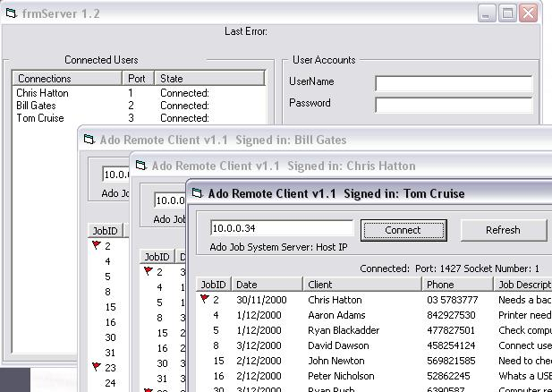



## Remote Ado Winsock Project

### Description

Updated!!

Ado project now supports multi-user connections and is much more stable than ever before. if you have more than one connection open, the server now refreshes all clients connected when a new job has been created or modified.

Server keeps a real time status of active and disconnected users, great great over vpn, or internet connection.

ADO Project allows remote users to access a database over a network/dialup connection. You will be able to access the database fully, with Add/Delete, Read/Write access. Also i have inbedded authentication against the database via the winsock control. This program is simply for basic job tracking, from inhouse, and for remote access areas. Bascially how this works, It sends the server a few commands/strings, and the server generates the sql statement and sends back the results, to the client winsock application, it then recieves the information and displays it out into a listview control with columns
 
### More Info
 

             |
---                |---
**Submitted On**   |2000-12-03 20:55:10
**By**             |[Chris Hatton](https://github.com/Planet-Source-Code/PSCIndex/blob/master/ByAuthor/chris-hatton.md)
**Level**          |Advanced
**User Rating**    |5.0 (95 globes from 19 users)
**Compatibility**  |VB 4\.0 \(32\-bit\), VB 5\.0, VB 6\.0
**Category**       |[Databases/ Data Access/ DAO/ ADO](https://github.com/Planet-Source-Code/PSCIndex/blob/master/ByCategory/databases-data-access-dao-ado__1-6.md)
**World**          |[Visual Basic](https://github.com/Planet-Source-Code/PSCIndex/blob/master/ByWorld/visual-basic.md)
**Archive File**   |[Remote\_Ado170249212004\.zip](https://github.com/Planet-Source-Code/chris-hatton-remote-ado-winsock-project__1-51402/archive/master.zip)

